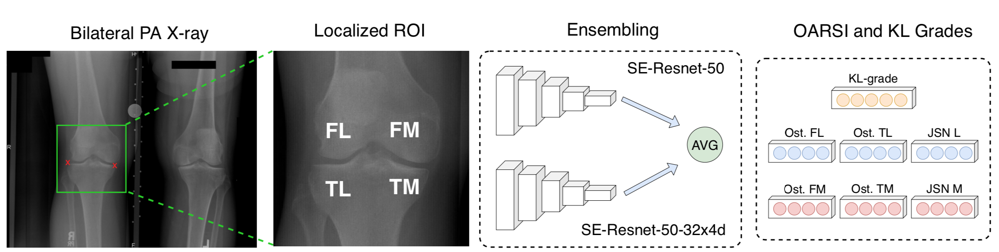

# Automatic Grading of Individual Knee Osteoarthritis Features in Plain Radiographs using Deep Convolutional Neural Networks
(c) Aleksei Tiulpin, University of Oulu, 2019

## About

In this paper, we tackled the problem of automating the process of grading individual osteoarthritis features in
knee plain radiographs. Our method is based on Deep Learning and simultaneously predicts the Kellgren Lawrence grades as well as
the grades for osteophytes and joint space narrowing compartment-wise according to the Osteoarthritis Research Society International (OARSI) grading atlas. In particular, we used transfer learning from ImageNet and trained an ensemble of neural networks to achieve the final results.

<center>

</center>

## Codes
We currently have no resources to provide a very thorough documentation to the code, but we believe that it is still possible to use it in your research and get familiar with
our methodology. However, we also provide the pre-trained models under non-commercial license. We understand that performing the first two steps is fairly challenging, therefore, the pre-trained models can be acquired here: <link>

### Installation
Create a new conda envrionment, activate it and install this package:

```
conda env create -f oarsi_grading.yml
conda activate oarsi_grading
pip install -e .
```

### Running the experiments
1. To run the experiments, you need to acquire OAI and MOST datasets. OAI dataset is fairly easy to acquire and can be found here: https://oai.epi-ucsf.org/datarelease/. Please contact the MOST dataset owners and request the dataset from them. University of Oulu is not able to release the data.

2. Once the data is acquired, you first need to pre-localize the knee joints which can be done using BoneFinder tool (http://bone-finder.com) or e.g. by training an object detector.

3. Set the paths to MOST and OAI data (localized and converted to `*.png`) as in the code.

4. Execute `run_experiments.sh` script to train all the models.

## Results
These are the results of our trained models:

| Side | Grade | F1 score | MSE  | Balanced Accuracy | Cohen's kappa | F1 (SOTA) | Balanced Accuracy (SOTA\*) | Cohen's kappa (SOTA\*) |
|------|-------|----------|------|-------------------|---------------|-----------|--------------------------|----------------------|
| L    | FO    | 0.81     | 0.33 | 63.58             | 0.79          | 0.67      | 44.3                     | 0.47                 |
|      | TO    | 0.83     | 0.22 | 68.85             | 0.84          | 0.72      | 47.6                     | 0.52                 |
|      | JSN   | 0.96     | 0.04 | 78.55             | 0.94          | 0.93      | 69.1                     | 0.80                 |
| M    | FO    | 0.81     | 0.41 | 65.49             | 0.84          | 0.61      | 45.8                     | 0.48                 |
|      | TO    | 0.77     | 0.26 | 72.02             | 0.83          | 0.66      | 47.9                     | 0.61                 |
|      | JSN   | 0.82     | 0.20 | 80.66             | 0.90          | 0.75      | 73.4                     | 0.75                 |
| Both | KL    | 0.65     | 0.68 | 66.68             | 0.82          | 0.60      | 63.6                     | 0.69                 |

\*We compare our method to the data published in the PhD thesis of J.Antony at Insight Centre, Dublin, Ireland (2018).

## License

This code and the pre-trained models are not available for any commercial use.
